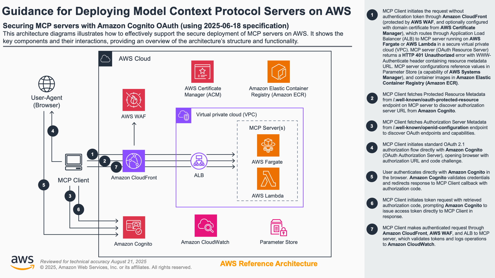

# Guidance for Deploying Model Context Protocol Servers on AWS

## Table of Contents

1. [Overview](#overview)
   - [Cost](#cost)
2. [Prerequisites](#prerequisites)
   - [Operating System](#operating-system)
3. [Deployment Steps](#deployment-steps)
4. [Deployment Validation](#deployment-validation)
5. [Running the Guidance](#running-the-guidance)
6. [Next Steps](#next-steps)
7. [Cleanup](#cleanup)
8. [FAQ, known issues, additional considerations, and limitations](#faq-known-issues-additional-considerations-and-limitations)
9. [Revisions](#revisions)
10. [Notices](#notices)

## Overview

This guidance demonstrates how to deploy Model Context Protocol (MCP) servers on AWS with secure authentication using Amazon Cognito, implementing the **2025-06-18 MCP specification** with OAuth 2.0 Protected Resource Metadata (RFC9728). It enables you to host MCP servers that can be accessed remotely while maintaining security through standards-compliant OAuth 2.0 authentication flows.

The solution addresses several key challenges:

- Secure hosting of MCP servers on AWS infrastructure
- Standards-compliant authentication using OAuth 2.0 Protected Resource Metadata (RFC9728)
- Remote access to MCP servers through secure StreamableHTTP transport
- Stateless server architecture for concurrent client support
- Scalable and maintainable deployment using AWS CDK

### Architecture



The architecture implements:

1. **CloudFront distribution** for global content delivery with WAF protection
2. **Application Load Balancer** for traffic distribution and SSL termination
3. **ECS Fargate and Lambda** for containerized and serverless MCP servers
4. **AWS Cognito** for OAuth 2.0 authorization server functionality
5. **OAuth 2.0 Protected Resource Metadata** endpoints for standards-compliant authentication
6. **StreamableHTTP transport** with stateless request handling
7. **Four-stack CDK deployment**: VPC, Security, CloudFront WAF, and MCP Server stacks

### Cost

You are responsible for the cost of the AWS services used while running this Guidance. As of August 2025, the cost for running this Guidance with the default settings in the US East (N. Virginia) Region is approximately $194.18 per month for processing moderate traffic levels.

We recommend creating a [Budget](https://docs.aws.amazon.com/cost-management/latest/userguide/budgets-managing-costs.html) through [AWS Cost Explorer](https://aws.amazon.com/aws-cost-management/aws-cost-explorer/) to help manage costs. Prices are subject to change. For full details, refer to the pricing webpage for each AWS service used in this Guidance.

#### Estimated Cost Table

The following table provides a sample cost breakdown for deploying this Guidance with the default parameters in the US East (N. Virginia) Region for one month.

| AWS service            | Dimensions                                         | Cost [USD]        |
| ---------------------- | -------------------------------------------------- | ----------------- |
| VPC (NAT Gateway)      | 1 NAT Gateway × 730 hours + 100 GB data processing | $37.35            |
| Elastic Load Balancing | Application Load Balancer with moderate traffic    | $16.83            |
| Amazon Cognito         | 10,500 MAUs (within 50,000 free tier)              | $0.00             |
| CloudFront             | 2 TB data transfer + 15M requests                  | $87.96            |
| WAF                    | 2 Web ACLs (CloudFront and Regional)               | $10.00            |
| DynamoDB               | Token storage with on-demand capacity              | $5.40             |
| ECS (Fargate)          | 1 vCPU, 2GB memory × 730 hours                     | $36.04            |
| Secrets Manager        | 1 secret for Cognito credentials                   | $0.40             |
| Lambda                 | Custom resources (minimal usage)                   | $0.20             |
| **Total**              |                                                    | **$194.18/month** |

## Prerequisites

### Operating System

These deployment instructions are optimized to work on **Amazon Linux 2 AMI**. Deployment in another OS may require additional steps.

### Required Tools

1. [AWS CLI](https://aws.amazon.com/cli/) installed and configured
2. [Node.js](https://nodejs.org/) v14 or later
3. [AWS CDK](https://aws.amazon.com/cdk/) installed:
   ```bash
   npm install -g aws-cdk
   ```

### AWS CDK Bootstrap

If you're using AWS CDK for the first time, bootstrap your account:

```bash
cdk bootstrap
```

## Deployment Steps

1. Clone the repository:

   ```bash
   git clone <repository-url>
   cd guidance-for-deploying-model-context-protocol-servers-on-aws
   cd source/cdk/ecs-and-lambda
   ```

2. Install dependencies:

   ```bash
   npm install
   ```

3. Login to public ECR:

   ```bash
   aws ecr-public get-login-password --region us-east-1 | docker login --username AWS --password-stdin public.ecr.aws
   ```

4. Deploy the stacks:

   Without domain configuration:

   ```bash
   cdk deploy --all
   ```

   Or with domain configuration:

   ```bash
   cdk deploy --all --context certificateArn=arn:aws:acm:... --context customDomain=mcp-server.example.com
   ```

5. Update MCP servers:

   Without domain configuration:

   ```bash
   cdk deploy MCP-Server
   ```

   Or with domain configuration:

   ```bash
   cdk deploy MCP-Server --context certificateArn=arn:aws:acm:... --context customDomain=mcp-server.example.com
   ```

## Deployment Validation

1. Verify CloudFormation stack status:

   - Open AWS CloudFormation console
   - Check that all stacks show "CREATE_COMPLETE"

2. Validate Cognito setup:

   - Open Amazon Cognito console
   - Verify User Pool creation
   - Confirm App Client configuration

3. Verify infrastructure:
   - CloudFront distribution is "Deployed"
   - Application Load Balancer is "Active"
   - ECS services are running

## Running the Guidance

### Testing with Cognito Users (Development Only)

For development and testing environments only, you can quickly create and manage users with AWS CLI:

```bash
# Create test user
aws cognito-idp admin-create-user --user-pool-id YOUR_USER_POOL_ID --username test@example.com

# Set permanent password (bypass temporary)
aws cognito-idp admin-set-user-password --user-pool-id YOUR_USER_POOL_ID --username test@example.com --password "TestPass123!" --permanent
```

### Testing with the Sample Python MCP Client

The deployment includes a sample Python MCP client that demonstrates OAuth 2.0 Protected Resource authentication with the deployed servers. This client implements the 2025-06-18 MCP specification with StreamableHTTP transport.

### Why Use the Python Client?

The included Python client (`source/sample-clients/simple-auth-client-python/`) demonstrates:

- **OAuth 2.0 Protected Resource Metadata** (RFC9728) authentication flow
- **StreamableHTTP transport** communication
- **Interactive CLI interface** for testing MCP tools
- **Standards-compliant implementation** of the 2025-06-18 MCP specification

> **Important:** This implementation does **not support Dynamic Client Registration (DCR)**. Client credentials must be pre-configured in AWS Cognito and provided via environment variables.

### Using the Python Client

1. Navigate to the client directory:

   ```bash
   cd source/sample-clients/simple-auth-client-python
   ```

2. Install dependencies with uv:

   ```bash
   pip install uv
   uv sync --reinstall
   ```

3. Set environment variables:

   ```bash
   export MCP_SERVER_URL="https://<your-cloudfront-endpoint>/weather-nodejs/mcp"
   export OAUTH_CLIENT_ID="<your-cognito-client-id>"
   export OAUTH_CLIENT_SECRET="<your-cognito-client-secret>"
   ```

4. Run the client:

   ```bash
   uv run python -m mcp_simple_auth_client.main
   ```

5. Test available endpoints:

   - **ECS Fargate Server**: `https://<your-cloudfront-endpoint>/weather-nodejs/mcp`
   - **Lambda Server**: `https://<your-cloudfront-endpoint>/weather-nodejs-lambda/mcp`

The client will automatically handle the OAuth flow, open a browser for authentication, and provide an interactive CLI to test the MCP tools.

## Next Steps

1. Implement additional MCP servers:

   - Add new server containers to ECS
   - Configure OAuth flows for new servers
   - Update client configurations for new endpoints

2. Optimize costs:

   - Monitor usage patterns
   - Consider reserved capacity for steady workloads
   - Implement caching strategies

3. Enhance security:
   - Enable MFA in Cognito
   - Implement additional WAF rules
   - Set up monitoring and alerting

## Cleanup

1. Remove deployed resources:

   ```bash
   cdk destroy --all
   ```

2. Manual cleanup steps:
   - Empty any created S3 buckets
   - Delete Cognito User Pool (if not needed)
   - Remove CloudWatch log groups
   - Delete any created secrets in Secrets Manager

## FAQ, known issues, additional considerations, and limitations

### Known Issues

1. Token refresh may require re-authentication in some cases
2. CloudFront cache invalidation may take up to 5 minutes
3. Initial cold start delay for Fargate containers

### Additional Considerations

- **OAuth 2.0 Compliant**: Implements RFC9728 Protected Resource Metadata specification
- **Stateless Architecture**: Each request creates new server instance for concurrent client support
- **Public endpoints are created** for OAuth Protected Resource Metadata discovery
- **CloudFront distributions** may take 15-20 minutes to deploy
- **Four-stack deployment**: VPC, Security, CloudFront WAF, and MCP Server stacks

For detailed information, refer to these additional documentation files:

- [Monthly Cost Estimate Report](assets/cost-estimate-report.md)
- [AWS Architecture & OAuth 2.0 Flow](assets/aws-cognito-mcp-integration.md)

### Limitations

1. **No Dynamic Client Registration (DCR)**: Client credentials must be pre-configured in AWS Cognito
2. **Region availability** depends on AWS Cognito support
3. **Custom domains** require ACM certificates in us-east-1
4. **CloudFront WAF only**: AWS WAF is configured for CloudFront distribution, not ALB directly
5. **StreamableHTTP transport only**: SSE transport (deprecated) not supported in this implementation
6. **Some MCP clients** may not support remote connections or OAuth flows

For any feedback, questions, or suggestions, please use the issues tab under this repo.

## Revisions

### [2.0.0] - 2025-08-25

- **BREAKING CHANGE**: Migrate to 2025-06-18 MCP specification
- Implement OAuth 2.0 Protected Resource Metadata (RFC9728)
- Replace SSE transport with StreamableHTTP transport
- Add stateless server architecture for concurrent client support
- Remove Dynamic Client Registration (DCR) - clients must be pre-configured
- Restructure project to `source/cdk/ecs-and-lambda/` for better organization
- Add sample Python MCP client with interactive CLI
- Implement four-stack CDK deployment (VPC, Security, CloudFront WAF, MCP Server)
- Add Lambda-based MCP server deployment option
- Remove DynamoDB token storage - now using stateless authentication

### [1.0.0] - 2025-05-06

- Initial release
- Basic OAuth flow implementation
- Support for weather sample servers

## Notices

Customers are responsible for making their own independent assessment of the information in this Guidance. This Guidance: (a) is for informational purposes only, (b) represents AWS current product offerings and practices, which are subject to change without notice, and (c) does not create any commitments or assurances from AWS and its affiliates, suppliers or licensors. AWS products or services are provided "as is" without warranties, representations, or conditions of any kind, whether express or implied. AWS responsibilities and liabilities to its customers are controlled by AWS agreements, and this Guidance is not part of, nor does it modify, any agreement between AWS and its customers.
