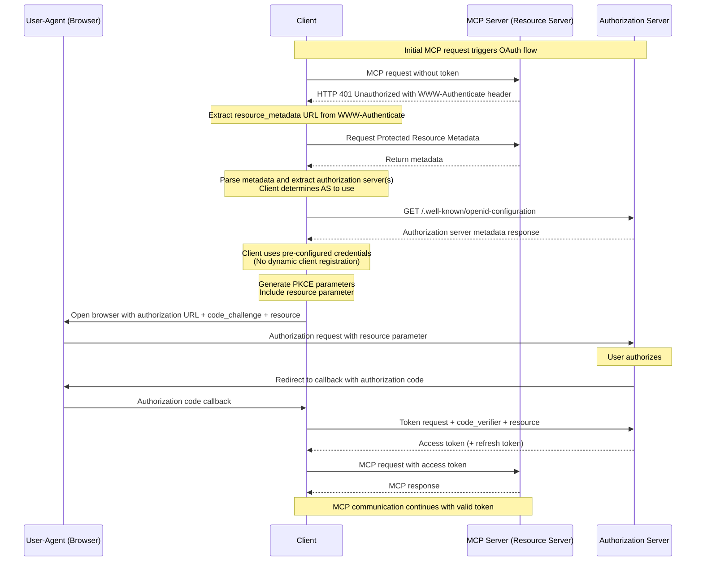
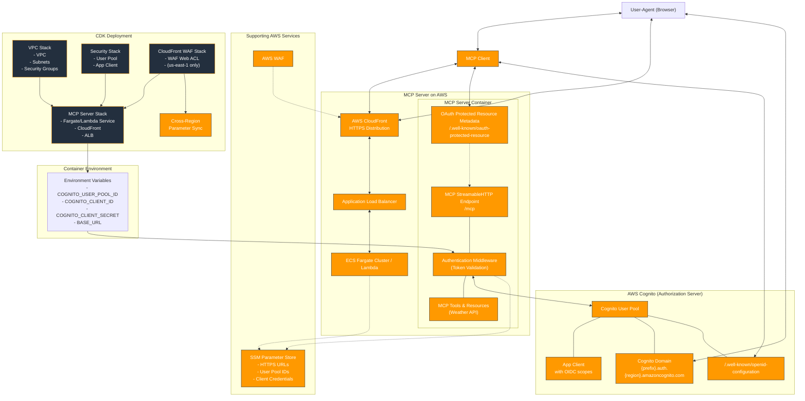

# AWS Cognito Integration with MCP Server

This document illustrates the technical architecture of AWS Cognito integration with MCP servers using OAuth 2.0 Protected Resource Metadata (RFC9728) and StreamableHTTP transport, implementing the 2025-06-18 MCP specification.

## OAuth 2.0 Protected Resource Flow

The complete Authorization flow proceeds as follows:



## Architecture Components



## Key Implementation Details

### OAuth 2.0 Protected Resource Metadata (RFC9728)

The MCP server implements OAuth 2.0 Protected Resource Metadata specification:

- **Endpoint**: `/.well-known/oauth-protected-resource`
- **Purpose**: Advertises OAuth configuration and authorization servers
- **Content**: JSON metadata including resource identifier and supported authorization servers

### WWW-Authenticate Header

When unauthorized requests are made to the MCP endpoint:

```http
HTTP/1.1 401 Unauthorized
WWW-Authenticate: Bearer realm="mcp-server", resource_metadata="https://example.com/.well-known/oauth-protected-resource"
```

### StreamableHTTP Transport

- **Protocol**: HTTP/HTTPS with JSON-RPC 2.0 over POST requests
- **Stateless**: Each request creates a new server instance for concurrent client support
- **Authentication**: Bearer token validation on each request
- **Endpoints**:
  - `POST /mcp` - Main MCP communication endpoint
  - `GET /.well-known/oauth-protected-resource` - OAuth metadata endpoint

### Token Validation Flow

1. Client makes MCP request without authentication
2. Server responds with 401 and WWW-Authenticate header
3. Client discovers OAuth metadata from protected resource endpoint
4. Client performs OAuth authorization code flow with PKCE
5. Client includes resource parameter in OAuth requests
6. Client makes authenticated MCP requests with bearer token
7. Server validates token against AWS Cognito User Pool

### Environment Configuration

The MCP server requires these environment variables:

- `COGNITO_USER_POOL_ID` - AWS Cognito User Pool identifier
- `COGNITO_CLIENT_ID` - OAuth client identifier (optional for public clients)
- `COGNITO_CLIENT_SECRET` - OAuth client secret (for confidential clients)
- `BASE_URL` - Base URL for generating OAuth metadata
- `AWS_REGION` - AWS region for Cognito integration

### Deployment Architecture

- **VPC Stack**: Creates VPC, subnets, and security groups for network infrastructure
- **Security Stack**: Creates Cognito User Pool and App Client for authentication
- **CloudFront WAF Stack**: Creates WAF Web ACL for CloudFront (deployed in us-east-1 only)
- **MCP Server Stack**: Deploys Fargate service or Lambda function, CloudFront distribution, and Application Load Balancer
- **Cross-Region Sync**: Synchronizes CloudFront WAF parameters across AWS regions

### Client Implementation

The Python client demonstrates:

- **Pre-configured Client Credentials**: Uses static client ID/secret (no dynamic client registration)
- **PKCE Flow**: Proof Key for Code Exchange for enhanced security
- **Resource Parameters**: Including resource identifier in OAuth requests
- **Token Management**: Automatic token refresh and storage
- **Interactive Interface**: Command-line interface for testing MCP tools

### Important Limitations

- **No Dynamic Client Registration (DCR)**: This implementation does not support dynamic client registration. Client credentials must be pre-configured in AWS Cognito and provided via environment variables.

This implementation follows the 2025-06-18 MCP specification with full OAuth 2.0 Protected Resource support, enabling secure and standards-compliant authentication for MCP servers deployed on AWS.
